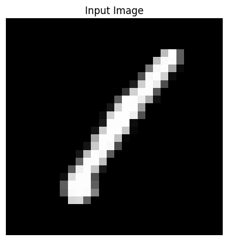
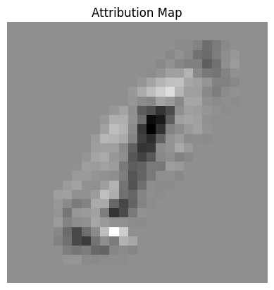
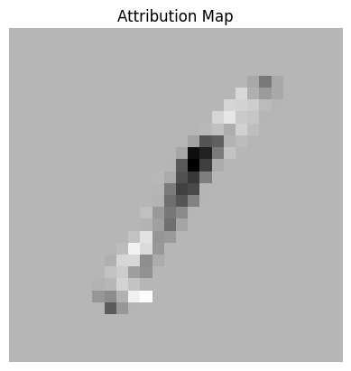
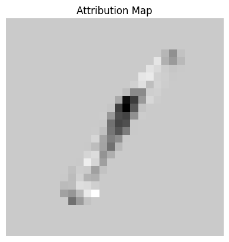
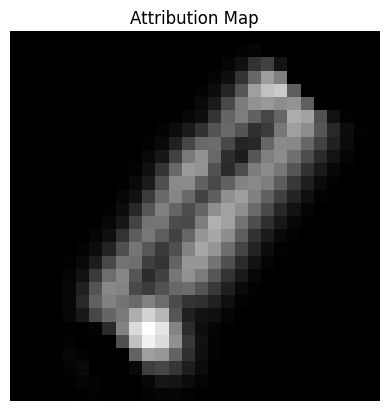
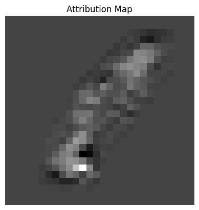
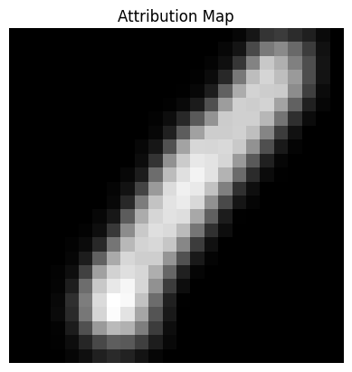
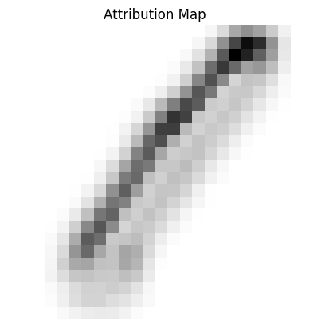
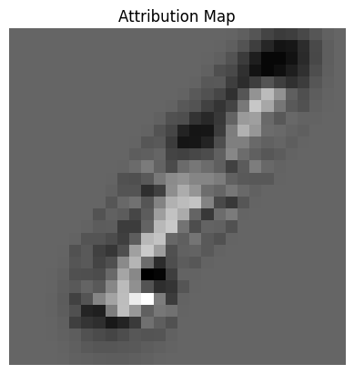

# Jax Feature Attribution Methods

This repository demonstrates a suite of feature attribution methods implemented using Jax and Flax. The primary focus is on how the algorithms work and how to implement them using the tools provided by Jax and Flax. MNIST was chosen as the dataset for the demonstrations because it doesn't require training complex models to perform well on the dataset. This allows us to use  simple perceptron or convolutional classification models and direct most of the focus on the feature attribution algorithms. In order to provide a better understanding of the algorithms values compared to other algorithms, brief descriptions of the algorithms features and drawbacks are provided in the section below. If you would like to understand the algorithms in more detail, the original papers are provided in the references section at the bottom.   

## Algorithms Summary

<details>
<summary>Gradients</summary>

The attribution map is the gradients of the input image.




#### Requirements:
 - Classification Model: Any continuously differentiable model.
 - Gradients of the input.
#### Pros:
 - Easy to implement.
 - Simple to understand.
 - High resolution attribution map.
 - Fast: Only needs a single backwards pass to calculate gradients.
 - Works on a wide range of models.
#### Cons:
 - Lots of noise in the attribution map.
 - Low accuracy.
 - Violates the sensitivity axiom (gradient can be zero despite of the input changing), shown in [Integrated Gradients].
</details>

<details>
<summary>Gradients X Input</summary>

The attribution map is the gradients of the input image times the input image.




#### Requirements:
 - Same as Gradients method
#### Pros:
 - Same as Gradients method, but better accuracy.
#### Cons:
 - Same as Gradients method
</details>

<details>
<summary>Integrated Gradients</summary>

The attribution map is extracted by taking the integral of multiple input image gradients at different scales. The scales are extracted by linearly increasing the pixel values from the input image.




#### Requirements:
 - Classification Model: Any continuously differentiable model.
 - Integral of the gradients of multiple scaled inputs. 
#### Pros:
 - High resolution attribution map.
 - Works on a wide range of models.
 - Class discriminative (localizes the category in the image).
#### Cons:
 - Slow: Requires multiple backwards passes of the model.
 - Complex: Requires more knowledge and code than gradients.
</details>

<details>
<summary>Deconvolution</summary>

A deconvolutional version of the neural network is created. Then the values from a convolutional layer are passed through the deconvolutional network to convert the features to pixel space, which produces the desired attribution map.




#### Requirements:
 - Classification Model: A convolutional neural network.
 - A deconvolutional version of the classification model.
 - Access the values of a convolutional layer in the classification model.
#### Pros:
 - High resolution attribution map.
 - Fast: Need a single pass through the deconvolutional model.
#### Cons:
 - Need to create a deconvolutional model.
 - Fails to highlight gradients that contribute negatively, as described in [DeepLIFT].
 - Not class discriminative (doesn't localize the category in the image), shown in [Grad-CAM].
</details>

<details>
<summary>Guided Backpropagation</summary>

The relu layers of the original classification model are replaced with guided relu layers. Guided relu layers work by  zeroing negative values in both the forward and backward directions. The gradients of the input image from the model with guided relu layers are then used as the attribution map.




#### Requirements:
 - Classification Model: A convolutional neural network.
 - A new relu layer, called guided relu.
 - Gradients of the inputs with respect to the model with guided relu layers.
#### Pros:
 - High resolution attribution map.
 - Fast: Need a single backward pass through the model with guided relu layers.
#### Cons:
 - Need to create a new type of relu layer.
 - Guided relu performs poorly during training.
 - Fails to highlight gradients that contribute negatively, as described in [DeepLIFT].
 - Complex: Implementing guided relu requires an advanced understanding of the frameworks tools.
 - Not class discriminative (doesn't localize the category in the image), shown in [Grad-CAM].
</details>

<details>
<summary>Class Activation Mapping (CAM)</summary>

Global average pooling is applied to a convolutional layer (can be any convolutional layer in the network) to extract a vector of weights. The weights are then multiplied by the filters of the convolutional layer. The weighted filters are then summed up to get the attribution map.




#### Requirements:
 - Classification Model: A convolutional neural network.
 - Access the values of a convolutional layer in the classification model.
#### Pros:
 - Fast: Only need a mean and dot product operation on the convolutional layer.
 - Simple to understand.
 - Class discriminative (localizes the category in the image), shown in [Grad-CAM].
#### Cons:
 - Low resolution attribution map.
 - Global average pooling performs poorly during training (but there is a way to train without it).
</details>

<details>
<summary>Grad-CAM</summary>

Uses the same method as CAM, but now the weights are extracted from the gradients of the convolutional layer.




#### Requirements:
 - Classification Model: A convolutional neural network.
 - Access the values and gradients of the final convolutional layer in the classification model.
#### Pros:
 - Fast: Need to perform a single backwards pass, plus the same CAM operations.
 - Class discriminative (localizes the category in the image), shown in [Grad-CAM].
#### Cons:
 - Low resolution attribution map.
 - Requires more code and complexity than CAM while providing similar accuracy.
</details>

<details>
<summary>Guided Grad-CAM</summary>

Calculates the attributions from both Grad-CAM and guided backprop, then multiplies them together to produce the final attribution map.




#### Requirements:
 - Classification Model: A convolutional neural network.
 - All the requirements from Grad-CAM and Guided backprop.
#### Pros:
 - Fast: Only a single backwards pass is needed.
 - Class discriminative (localizes the category in the image), shown in [Grad-CAM].
 - High resolution attribution map.
#### Cons:
 - Complex: Need to implement both Grad-CAM and guided backprop.
</details>

## Installation Requirements

Jax is a requirement for the notebooks, you can install GPU accelerated Jax by running the command below.
```
pip install -U "jax[cuda12]"
``` 
The following packages are also required.
```
pip install flax
pip install jupyter
pip install pandas
pip install matplotlib
pip install requests
pip install urllib3
```


## References
 - [Gradients] - [Deep Inside Convolutional Networks: Visualising Image Classification Models and Saliency Maps](https://arxiv.org/abs/1312.6034)
 - [Integrated Gradients] - [Axiomatic Attribution for Deep Networks](https://arxiv.org/abs/1703.01365)
 - [Deconvolution] - [Visualizing and Understanding Convolutional Networks](https://arxiv.org/abs/1311.2901)
 - [Guided Backprop] - [Striving for Simplicity: The All Convolutional Net](https://arxiv.org/abs/1412.6806)
 - [CAM] - [Learning Deep Features for Discriminative Localization](https://arxiv.org/abs/1512.04150)
 - [Grad-CAM] - [Grad-CAM: Visual Explanations from Deep Networks via Gradient-based Localization](https://arxiv.org/abs/1610.02391)
 - [DeepLIFT] - [Learning Important Features Through Propagating Activation Differences](https://arxiv.org/abs/1704.02685)

